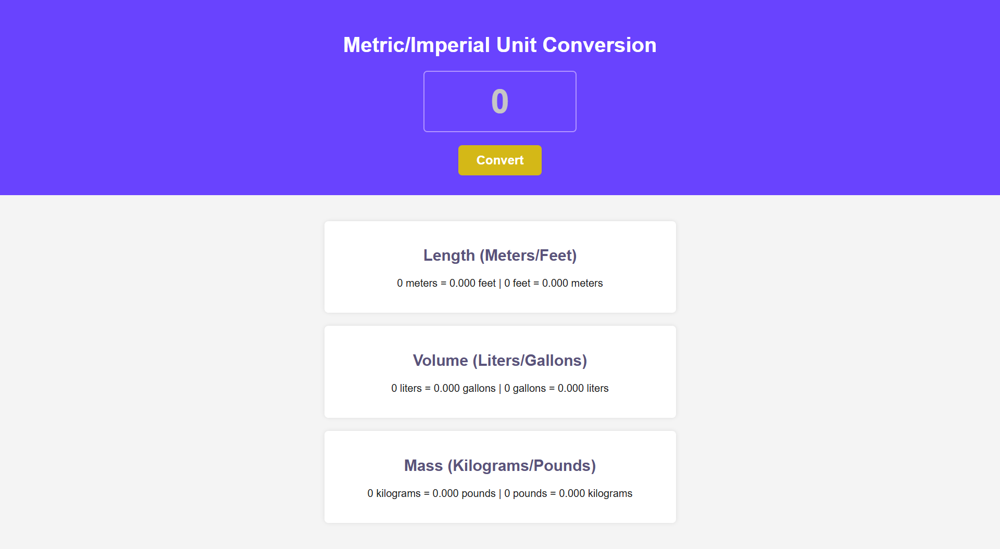

# 🔄 Unit Converter

A solo project from the [Scrimba Frontend Developer Career Path](https://scrimba.com/frontend-path-c0j).  
This project is a **metric-to-imperial unit converter** where users can input a number and instantly see conversions for **length**, **volume**, and **mass** between metric and imperial units, rounded to **three decimal places** for readability.

## 🛠️ Technologies
- HTML5  
- CSS3  
- JavaScript (ES6)

## 🚀 Features
- Users can enter a number to convert it across multiple units in real-time.
- Length conversions between meters and feet are calculated dynamically.
- Volume conversions between liters and gallons are calculated dynamically.
- Mass conversions between kilograms and pounds are calculated dynamically.
- Input validation prevents invalid entries and alerts the user.
- Conversion results are displayed clearly in the DOM for easy reading.

## 🧠 What I Learned / Process
- Practiced reading values from user input and updating the DOM dynamically.
- Learned to organize reusable functions for calculations (`convertUnits`) and rendering (`displayConversions`).
- Learned how to **format numbers** and handle rounding using `toFixed()`.
- Implemented basic input validation with `isNaN` to handle user errors gracefully.

## 💡 Future Improvements
- Add more unit categories (temperature, speed, time, etc.).
- Allow live conversion while typing (instead of clicking a button).
- Add **input validation and error messages** for invalid entries.

## 🖼️ Preview

## 📚 Sources & References
- Scrimba course: [Scrimba Frontend Developer Career Path](https://scrimba.com/frontend-path-c0j)  
- Figma Design reference by Scrimba: [View Figma Design](https://www.figma.com/design/cqtGul0V8RFXY4vTcIv1Kc/Unit-Conversion?node-id=0-1&p=f&t=tEvEgoYoLIuq4LOS-0)

